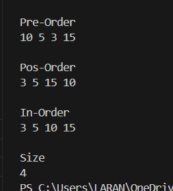
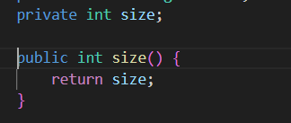
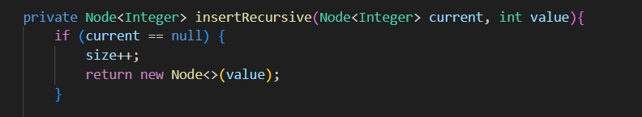
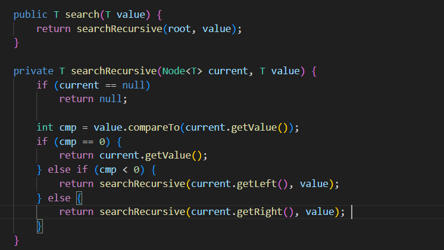
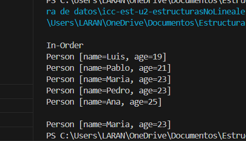
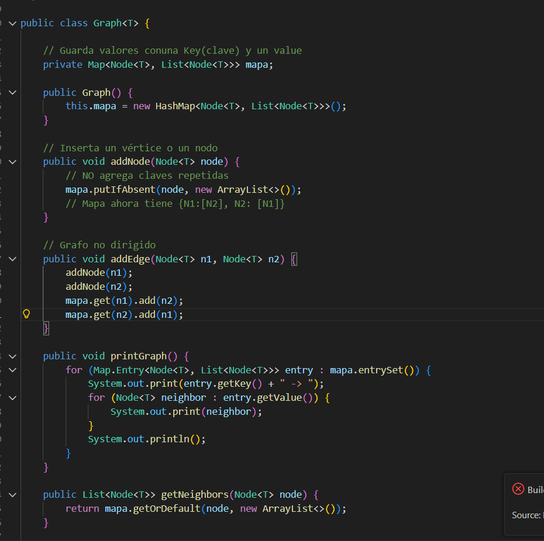

# Práctica: Estructuras No Lineales - 

## Autor
- Nombre: Juliana Torres
- Carrera/Curso: Computación / Estructura de Datos

## Nombre de la práctica - Fecha
- Práctica: Práctica de Árboles – Implementación Integers
- Fecha: 2026-01-05

## Descripción
En esta práctica se implementó un Árbol Binario de Búsqueda (BST) que permite la inserción de enteros y soporta los recorridos PreOrder, InOrder y PostOrder.
Además, se implementó el método size() que retorna el número total de nodos en el árbol con complejidad O(1), gracias a un contador interno que se actualiza en cada inserción.

## Evidencias
### Captura 1

Se muestran los recorridos del árbol:

-PreOrder: raíz → izquierda → derecha
-InOrder: izquierda → raíz → derecha (en BST, orden ascendente)
-PostOrder: izquierda → derecha → raíz
Finalmente, se imprime el tamaño del árbol (size), que es 4 porque se insertaron 4 nodos.

### Captura 2 

El atributo size se actualiza en el método insertRecursive cuando se crea un nuevo nodo:

Por esta razón, el método size() no necesita recorrer el árbol, simplemente retorna el contador, lo que lo hace O(1).

## Práctica de Árboles - Implementación Genéricos uso de interfaces Comparabes - 06/01/26

### Descripción 

En esta práctica se implementó un Árbol Binario de Búsqueda genérico en Java utilizando clases Tree<T> y Node<T>. El árbol permite insertar elementos de tipo genérico T siempre que implementen la interfaz Comparable, de manera que el criterio de ordenamiento se define en los objetos almacenados (por ejemplo, la clase Person ordena por edad).
Se desarrollaron los siguientes componentes:

Inserción de elementos en el árbol respetando el orden definido por compareTo.
Recorrido InOrder para mostrar los elementos en orden ascendente.
Método genérico de búsqueda (search(T value)) que localiza un elemento en el árbol usando el orden natural definido por Comparable.
Implementación específica con la clase Person para demostrar la funcionalidad, incluyendo búsqueda por edad mediante la creación de un objeto “sonda”.

La salida en consola muestra:

Los elementos insertados en orden (InOrder).
El resultado de la búsqueda de una persona por edad.

### Evidencias 

### Captura 1

### Captura 2

### Práctica de Graphs – Implementación Genérica con Strings - 08/01/26 

### Descripción 

En esta práctica se implementó un Grafo genérico en Java utilizando las clases Graph<T> y Node<T>. El grafo permite representar relaciones entre elementos mediante nodos y aristas, utilizando una estructura interna basada en un Map<Node<T>, List<Node<T>>> para almacenar las conexiones.
Se desarrollaron las siguientes funcionalidades:

- Inserción de nodos en el grafo.
- Inserción de aristas para conectar nodos (grafo no dirigido).
- Impresión del grafo completo, mostrando cada nodo y sus vecinos.
- Método para obtener los vecinos de un nodo específico, demostrando cómo acceder a las conexiones de un vértice.

La implementación se probó con objetos String para representar los nombres de los nodos. La salida en consola muestra:

- La estructura del grafo con sus conexiones.
- Los vecinos del nodo A, confirmando la correcta funcionalidad del método getNeighbors.

### Evidencias 

### Captura 1

### Captura 2

